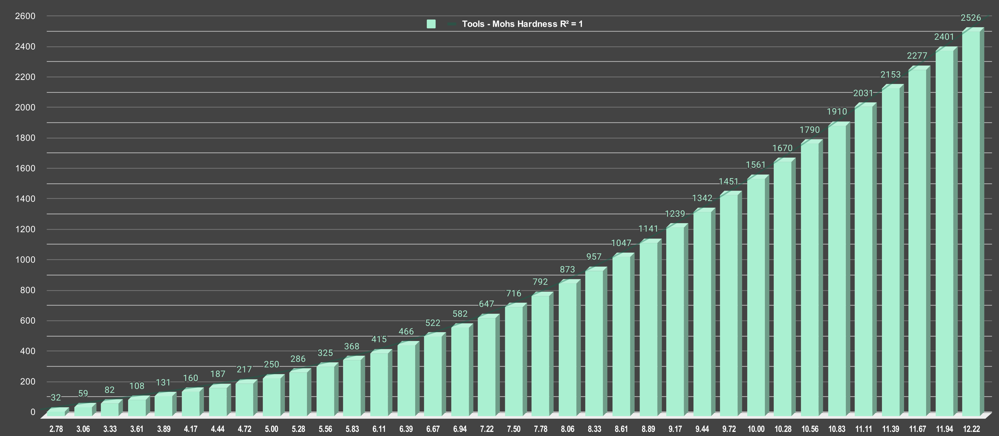
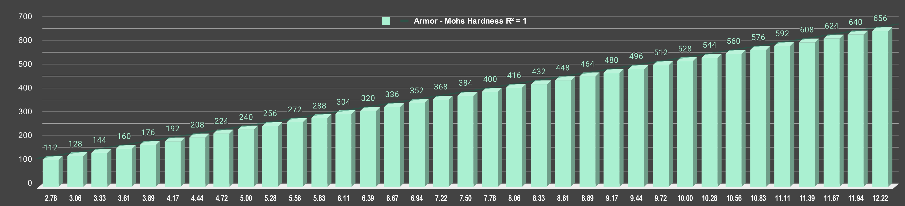

# Mohs Hardness to Durability Chart

This chart demonstrates how in-game durability for Minecraft tools and armor is derived from real-world Mohs hardness values, using the armor durability multiplier as the foundational anchor.

## Overview of the Process

### Step 1: Armor Durability Multiplier
The system begins with the **armor durability multiplier**, a fixed value defined within Minecraft's Vanilla code. This multiplier serves as the anchor point for scaling other variables, ensuring consistency with established gameplay mechanics.

### Step 2: Associating Mohs Hardness
Using real-world materials, Mohs hardness values are associated with the armor durability multiplier. These values can vary widely for real-world materials, making Mohs hardness the logical variable for scaling while the multiplier remains static.

### Step 3: Correlating Existing Durabilities
Known Vanilla values are integrated into the system, aligning tool and armor durability with Mohs hardness values derived from the multiplier. Remarkably, this correlation achieved an **R value of +1**, indicating perfect alignment with the Vanilla scale.

### Step 4: Building the System
With the multiplier as the fixed anchor, Mohs hardness as the variable, and durability values correlated with Vanilla materials, the system is extended to include interpolated values for non-Vanilla items, ensuring smooth progression and balance.

---

### Durability Scaling

Durability scaling differs based on the type:
- **Tool Durability**: Scales polynomially, reflecting exponential progression.
- **Armor Durability**: Scales linearly, providing a more consistent progression.

### Key Insights

With this chart, the only variable required is the Mohs hardness of the material—whether real or fictional. While the Mohs hardness value itself can be highly conceptual and variable, it serves as the cornerstone for calculating in-game durability.

This structured methodology combines mathematical precision with real-world materials to deliver an intuitive durability system for modded tools and armor.

---

## Detailed Durability Mapping

| Multiplier | Mohs Hardness | Tool Durability | Chest Durability | Material       | Source     |
|------------|---------------|-----------------|------------------|----------------|------------|
| 7          | 2.78          | 32              | 112              | Gold           | Vanilla    |
| 8          | 3.06          | 59              | 128              | Wood           | Vanilla    |
| 9          | 3.33          | 82              | 144              |                |            |
| 10         | 3.61          | 108             | 160              |                |            |
| 11         | 3.89          | 131             | 176              | Stone          | Vanilla    |
| 12         | 4.17          | 160             | 192              |                |            |
| 13         | 4.44          | 187             | 208              |                |            |
| 14         | 4.72          | 217             | 224              |                |            |
| 15         | 5.00          | 250             | 240              | Iron           | Vanilla    |
| 16         | 5.28          | 286             | 256              |                |            |
| 17         | 5.56          | 325             | 272              |                |            |
| 18         | 5.83          | 368             | 288              | Amethyst       | Pure Ameth |
| 19         | 6.11          | 415             | 304              | Moonstone      | Pure Ores  |
| 20         | 6.39          | 466             | 320              | Fire Opal      | Pure Ores  |
| 21         | 6.67          | 522             | 336              |                |            |
| 22         | 6.94          | 582             | 352              | Jadeite        | Pure Ores  |
| 23         | 7.22          | 647             | 368              |                |            |
| 24         | 7.50          | 716             | 384              | Ametrine       | Pure Ores  |
| 25         | 7.78          | 792             | 400              | Pure Amethyst  | Pure Ameth |
| 26         | 8.06          | 873             | 416              | Chrysoberyl    | Pure Ores  |
| 27         | 8.33          | 957             | 432              |                |            |
| 28         | 8.61          | 1047            | 448              |                |            |
| 29         | 8.89          | 1141            | 464              | Sapphire       | Pure Ores  |
| 30         | 9.17          | 1239            | 480              |                |            |
| 31         | 9.44          | 1342            | 496              |                |            |
| 32         | 9.72          | 1451            | 512              |                |            |
| 33         | 10.00         | 1561            | 528              | Diamond        | Vanilla    |
| 34         | 10.28         | 1670            | 544              |                |            |
| 35         | 10.56         | 1790            | 560              | Black Diamond  | Pure Ores  |
| 36         | 10.83         | 1910            | 576              |                |            |
| 37         | 11.11         | 2031            | 592              | Netherite      | Vanilla    |
| 38         | 11.39         | 2153            | 608              |                |            |
| 39         | 11.67         | 2277            | 624              |                |            |
| 40         | 11.94         | 2401            | 640              |                |            |
| 41         | 12.22         | 2526            | 656              | Lonsdaleite    | Pure Ores  |

## Graphical Representations

Below are graphical representations of the durability mappings for tools and armor, illustrating the relationships and progression:

*Figure 1: Tool durability scaling based on Mohs hardness.*

*Figure 2: Armor durability scaling based on Mohs hardness.*

## More Insights and Calculations

### Armor Durability Multiplier
- The multiplier is the cornerstone of this system, directly determining the durability of armors.
- It is defined in Minecraft's hard-coded Vanilla system, ensuring consistency.

### Mohs Hardness
- Mohs hardness values are scaled from the armor durability multiplier, using real-world materials as reference points.
- Since real-world materials can exhibit a wide range of Mohs hardness values, whereas the multiplier is a hardcoded integer, the Mohs value emerged as the most logical variable for scaling.
- **Calculation**: Mohs Hardness = `((Multiplier + 3) / 3.6)`

### Tool Durability
- Tool durability is calculated using an polynomial formula based on Mohs hardness, meaning that it scales exponentially:
- **Calculation**: Durability = `13.18 × e^(0.425 × Mohs)`

### Chest Durability
- Durability for the chestplate is calculated as **Multiplier × 16**. Other pieces scale as follows:
  - **Head**: Multiplier × 11
  - **Legs**: Multiplier × 15
  - **Feet**: Multiplier × 13
- The chestplate is highlighted due to its highest durability value, and 16 is just a good number.

---

## Why Toughness and Fracture Resistance Aren't Prioritized

This system focuses on Mohs hardness as the primary variable for calculating durability, deliberately excluding considerations of **toughness** and **fracture resistance**—key properties that determine how materials respond to stress or impact.

### The Science Behind It
- **Mohs Hardness**: Represents a material's resistance to scratching or surface deformation. Diamond excels in this category, making it an exceptional cutting material.
- **Toughness and Fracture Resistance**: These properties measure a material's ability to absorb energy and resist cracking under repeated impacts. Iron, despite being softer than diamond, possesses significantly higher toughness, which allows it to endure stress more effectively.

### Practical Implications
In real-world applications, materials with high hardness but low toughness—like diamond—are often brittle under force. For example:
- A diamond pickaxe, while incredibly hard, would fracture under repeated impacts against stone due to its low toughness.
- Conversely, an iron pickaxe is more effective for such tasks, as its durability and ability to absorb impact outperform diamond in these situations.

### Gameplay Balance
By centering durability calculations on Mohs hardness, the system simplifies progression while keeping mechanics intuitive. Mojang deliberately excluded toughness and fracture resistance from Vanilla material calculations, as incorporating these factors would complicate gameplay unnecessarily. Following their lead ensures consistency and aligns modded materials with established lore. 
